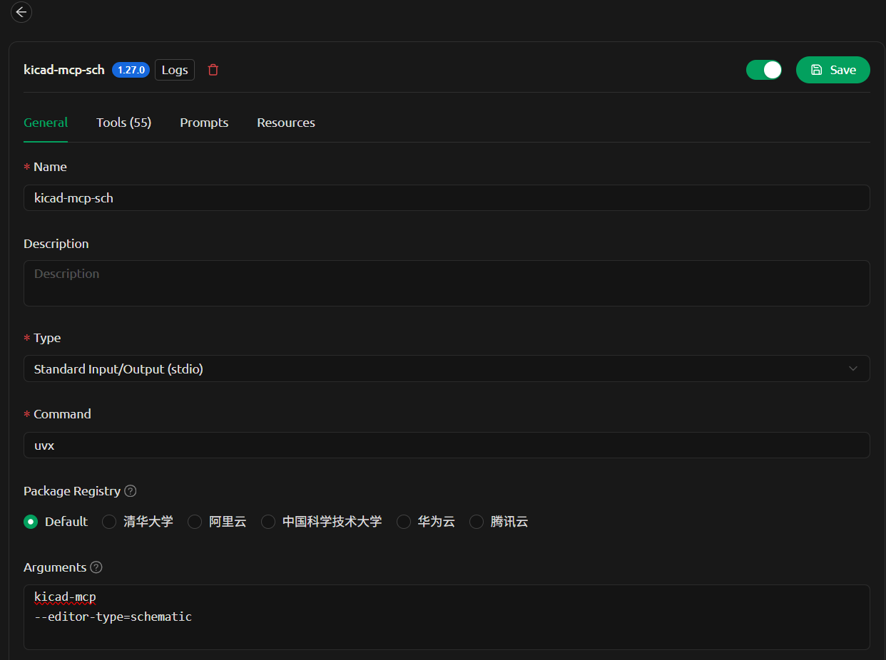

# kicad-mcp

KiCad MCP integrated with the KiCad IPC API.

---

## Usage

### Run the latest release

You can run the MCP server directly without installing it using `uvx`:

```bash
uvx kicad-mcp --editor-type schematic
```

This will download and execute the latest version from PyPI in an isolated environment.

---

### MCP client configuration (e.g. VS Code, Claude Desktop)

Add the following configuration to your MCP client:

```json
{
  "command": "uvx",
  "args": ["kicad-mcp", "--editor-type", "schematic"]
}
```

---

### Example (Cherry Studio)



---

### Options

`--editor-type` supports:

- `schematic`
- `pcb`
- `symbol`
- `footprint`

---

## Development

### 1. Clone the repository

```bash
git clone <your-repo-url>
cd kicad-mcp
```

---

### 2. Configure MCP client (local development)

Example configuration:

```json
{
  "servers": {
    "kicad-pcb-mcp": {
      "type": "stdio",
      "command": "uv",
      "args": [
        "--directory",
        "C:/code/kicad-mcp",
        "run",
        "kicad-mcp",
        "--editor-type",
        "pcb"
      ]
    },
    "kicad-schematic-mcp": {
      "type": "stdio",
      "command": "uv",
      "args": [
        "--directory",
        "C:/code/kicad-mcp",
        "run",
        "kicad-mcp",
        "--editor-type",
        "schematic"
      ]
    }
  }
}
```

---

### 3. Run locally

Install dependencies and run:

```bash
uv sync
uv run kicad-mcp --editor-type schematic
```

---

### 4. Iterate

Modify the code and restart your MCP client to see changes.

---

## Notes

- Requires `uv`: https://github.com/astral-sh/uv  
- Python 3.11+
- Ensure KiCad is running with IPC enabled

---

## License

MIT (or your preferred license)
